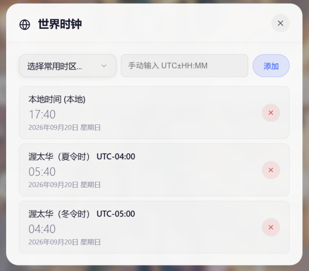
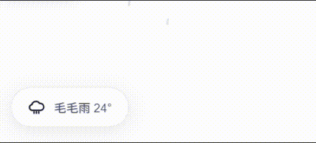

# 轻-soft 起始页v2 (SoftStartpage v2)

一个纯前端、可直接本地运行的浏览器起始页。 
 
在2026/7/25，由于暑假无聊，该项目被重构，重构之前的原文： 
"该项目本意是作为原生练手的项目，大一为了怀恋小学摸索原生前端做着玩的。没想到嵌入式大二还有web课，便继续更新了。" 
本想说之后没web课就不做了，但是还是那句话，AI还是太好用了🤫

## 快速开始

静态托管在了cloudflare和github。
可以将[github托管](https://hisuifeng.github.io/softstartpage/ "github托管")或[cloudflare托管(推荐)](https://softstartpage.pages.dev/ "cloudflare托管")设为主页地址，或者将其下载到本地。

## 功能

- **时钟**： 时钟支持 24/12 小时制、显示秒、多种日期格式
- **多引擎搜索**：  内置 Google / Bing / Baidu 等引擎，可自定义搜索引擎，支持 `Ctrl/Alt/Shift + 数字` 快捷切换
- **搜索联想**： 接入搜索引擎的联想接口（备用 API 可切换），支持搜索历史记录与一键清除
- **书签管理**： 支持拖拽排序、自定义名称/网址/图标（favicon），可在设置面板中增删改
- **壁纸**： 支持网络图片 URL 或本地上传，可一键清除 *由于本地使用的是localStorage技术，因此壁纸大小有限制 *未设置壁纸时，可开启随机选用 `img/wallpaper/black/`（暗色主题）或 `img/wallpaper/light/`（亮色主题）中的壁纸，替换图片即可自定义（仅静态托管生效）
- **天气模块**：
  - 左下角天气悬浮按钮，显示当前天气（基于 Open-Meteo API，因此天气预报仅供娱乐，但气温是准的）
  - 天气详情面板：温度 / 体感 / 降水 / 降雪趋势折线图
- **世界时钟**：  在世界时钟可以增加和编辑不同时区的时钟，查看多时区时间，预设常用城市，支持手动输入 UTC±HH:MM
- **动态背景**：
- “雨，静静的下起来了”  *下雨 / 下雪以及其他粒子特效，可在设置中开关

## 主要 API

- 天气：`https://api.open-meteo.com/v1/forecast`（Open-Meteo，缓存30分钟，经测试天气经常不准所以天气预报仅供娱乐，但气温是准的）
- 位置：`https://api.ip.sb/geoip`（IP 定位，缓存24小时）

## 配置与调试

如果你想进行自定义操作的话，这个希望能提供一些帮助。

### 图标

- 为了保证本地 `file://` 打开也能正常显示，页面中的图标由 `App.Utils.ICONS` 以**内联 `<svg>`** 形式注入，不依赖外部文件加载；`stroke="currentColor"` 使其自动跟随明暗主题。
- Canvas 图表中的天气图标通过 `App.Utils.svgDataUri()` 转为 base64 data URI 后由 `Image` 绘制。

### 调试
- 手动激活雨效
App.state.weatherEffectEnabled = true;
App.Weather.startEffect('rain', 4);
其中4是强度，参考 WMO_RAIN_MAP（小雨 23、中雨 45、大雨 8）；雪效同理 App.Weather.startEffect('snow', 4)。
停止：App.Weather.stopEffect();

### 存储

所有设置保存在浏览器 `localStorage`（键前缀 `sp_`）：

| 键 | 含义 |
| --- | --- |
| `sp_time` | 时间格式（24 小时、显示秒、日期格式） |
| `sp_bookmarks` | 书签数组 |
| `sp_history` | 搜索历史 |
| `sp_suggestions` | 搜索联想开关 |
| `sp_fallback` | 联想备用 API（baidu/bing/google） |
| `sp_modifier` | 引擎切换修饰键 |
| `sp_custom_engines` | 自定义搜索引擎 |
| `sp_engine` | 当前引擎 |
| `sp_weather_effect` | 雨雪特效开关 |
| `sp_custom_lat` / `sp_custom_lon` | 自定义经纬度 |
| `sp_location_cache` | 位置缓存（24h） |
| `sp_timezones` | 世界时钟时区列表 |
| `sp_wallpaper` | 壁纸来源 / URL（`none` 时自动使用主题默认壁纸） |
| `sp_particles` | 粒子背景开关 |